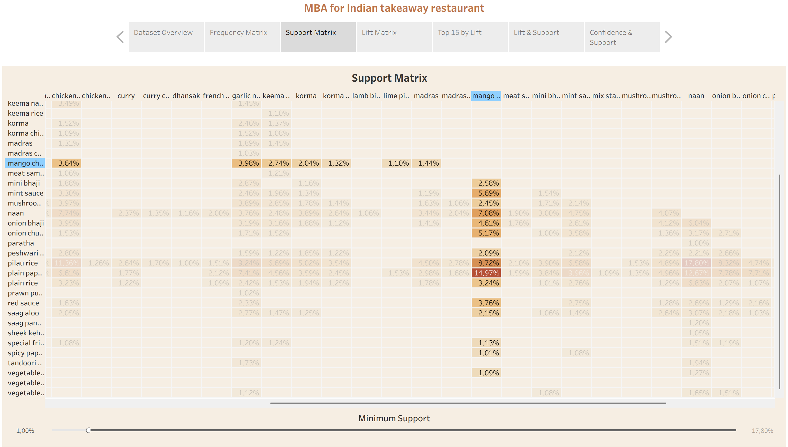
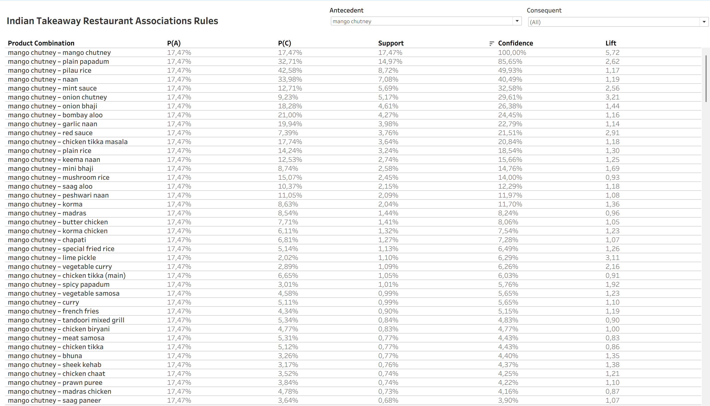
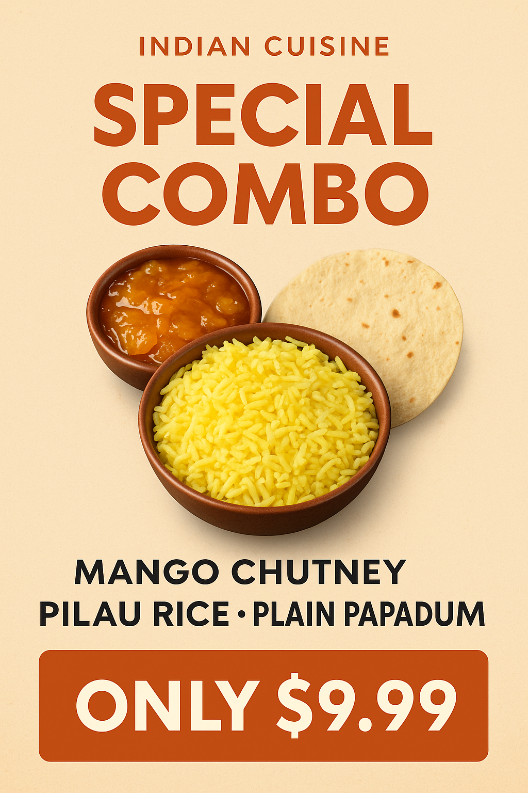

# indian-restaurant-takeaway-mba
Market Basket Analysis on 20k Indian takeaway orders — Python preprocessing, Apriori rules, Tableau dashboards, business insights.

> [!NOTE]
> Useful information that users should know, even when skimming content.

> [!TIP]
> Helpful advice for doing things better or more easily.

> [!IMPORTANT]
> Key information users need to know to achieve their goal.

> [!WARNING]
> Urgent info that needs immediate user attention to avoid problems.

> [!CAUTION]
> Advises about risks or negative outcomes of certain actions.
`code`

```
lots of code
```
>Higlight something

<details><summary>Toggle me!</summary>Peek a boo!</details>

<details open>
<summary>Shopping list</summary>

* Vegetables
* Fruits
* Fish

</details>

:mango:

## Repository Structure

- `data/raw/` — original CSV (unmodified)
- `data/processed/` — cleaned/prepared data ready for MBA
- `visuals/` —  screenshots od dashboards and ad-style promotional suggestions
- `tableau/` — Tableau packaged workbooks
- `notebooks/` — ipynb files for data preparation and apriori rules mining

## Data

Source: [Brazilian E-Commerce Public Dataset by Olist.](https://www.kaggle.com/datasets/olistbr/brazilian-ecommerce/data)

Orders made at [Olist store](https://www.olist.com/) (Brazil) in 2016 to 2018. Collection methodology: Random Sampling.
## Overview

## Data Preparation

## Analysis Methods
Apriori algorithm, Tableau visualizations.

## 🥭Single-dish Deep Dive

### Overview

Mango chutney is a popular condiment, appearing in 17.47% of all orders (for comparison, pilau rice — the most popular dish — appears in 42.58%).
This section shows how the project provides insights into the performance and associations of one specific dish across Tableau dashboards and Apriori algorithm outputs.

### Tableau Dashboards

In Part 1 (Tableau workbook) you can explore the Frequency, Support, and Lift Matrices. These matrices are symmetrical, so to avoid redundancy I only kept the lower half.
The use of color highlights the strongest associations, making patterns easy to spot at a glance.

<details><summary>Support Matrix (Tableau dasboard screenshot)</summary>

</details>

<details><summary>Lift Matrix (Tableau dasboard screenshot)</summary>

</details>

In Part 2 (Tableau workbook) you can filter by Antecedent/Consequent dish and sort by Frequency, Support, Confidence, or Lift, which allows quick comparisons between different rules.
<details><summary>Association rules table (Tableau dasboard screenshot)</summary>

</details>

Some insights: 

1. The strongest pair is {mango chutney} → {plain papadum}. Support: 14.97%, Confidence: 85.65%, Lift: 2.62.
   >👉 This means nearly 15% of all orders include this pair, and when mango chutney is ordered, papadum appears nearly 86% of the time. The high lift shows this is a genuine association, not     random.

2. Other strong associations: pilau rice, mint sauce, naan, onion chutney.

3. A “trick” pair example is {mango chutney} → {lime pickle}. Lift: 3.11, but Support is only 1.1% and Confidence 6.29%.
   >👉 This combination is statistically interesting but too rare to matter commercially.

### Apriori Algorithm Results
Unlike Tableau (limited to pairs), Apriori provides rules with 2–5 items.

<details>
<summary>Apriori sorted by Lift</summary>
  
```
{mango chutney} -> {onion chutney, plain papadum} (conf: 0.279, supp: 0.049, lift: 3.619, conv: 1.280)
{mango chutney} -> {plain papadum, red sauce} (conf: 0.202, supp: 0.035, lift: 3.237, conv: 1.175)
{mango chutney} -> {onion chutney} (conf: 0.296, supp: 0.052, lift: 3.207, conv: 1.289)
{mango chutney} -> {onion bhaji, plain papadum} (conf: 0.234, supp: 0.041, lift: 3.009, conv: 1.204)
{mango chutney} -> {mint sauce, plain papadum} (conf: 0.295, supp: 0.052, lift: 2.968, conv: 1.278)
{mango chutney} -> {red sauce} (conf: 0.215, supp: 0.038, lift: 2.911, conv: 1.180)
{mango chutney} -> {garlic naan, plain papadum} (conf: 0.207, supp: 0.036, lift: 2.795, conv: 1.168)
{mango chutney} -> {naan, pilau rice, plain papadum} (conf: 0.210, supp: 0.037, lift: 2.790, conv: 1.171)
{mango chutney} -> {naan, plain papadum} (conf: 0.353, supp: 0.062, lift: 2.788, conv: 1.350)
{mango chutney} -> {bombay aloo, plain papadum} (conf: 0.220, supp: 0.038, lift: 2.728, conv: 1.178)
{mango chutney} -> {pilau rice, plain papadum} (conf: 0.443, supp: 0.077, lift: 2.688, conv: 1.500)
{mango chutney} -> {plain papadum} (conf: 0.856, supp: 0.150, lift: 2.618, conv: 4.688)
{mango chutney} -> {mint sauce} (conf: 0.326, supp: 0.057, lift: 2.564, conv: 1.295)
{mango chutney} -> {onion bhaji} (conf: 0.264, supp: 0.046, lift: 1.443, conv: 1.110)
{mango chutney} -> {naan, pilau rice} (conf: 0.232, supp: 0.041, lift: 1.303, conv: 1.070)
{mango chutney} -> {naan} (conf: 0.405, supp: 0.071, lift: 1.192, conv: 1.110)
{mango chutney} -> {chicken tikka masala} (conf: 0.208, supp: 0.036, lift: 1.175, conv: 1.039)
{mango chutney} -> {pilau rice} (conf: 0.499, supp: 0.087, lift: 1.173, conv: 1.147)
{mango chutney} -> {bombay aloo} (conf: 0.245, supp: 0.043, lift: 1.165, conv: 1.046)
{mango chutney} -> {garlic naan} (conf: 0.228, supp: 0.040, lift: 1.143, conv: 1.037)
```
</details>


<details>
<summary>Apriori sorted by Support</summary>
  
```
{mango chutney} -> {plain papadum} (conf: 0.856, supp: 0.150, lift: 2.618, conv: 4.688)
{mango chutney} -> {pilau rice} (conf: 0.499, supp: 0.087, lift: 1.173, conv: 1.147)
{mango chutney} -> {pilau rice, plain papadum} (conf: 0.443, supp: 0.077, lift: 2.688, conv: 1.500)
{mango chutney} -> {naan} (conf: 0.405, supp: 0.071, lift: 1.192, conv: 1.110)
{mango chutney} -> {naan, plain papadum} (conf: 0.353, supp: 0.062, lift: 2.788, conv: 1.350)
{mango chutney} -> {mint sauce} (conf: 0.326, supp: 0.057, lift: 2.564, conv: 1.295)
{mango chutney} -> {onion chutney} (conf: 0.296, supp: 0.052, lift: 3.207, conv: 1.289)
{mango chutney} -> {mint sauce, plain papadum} (conf: 0.295, supp: 0.052, lift: 2.968, conv: 1.278)
{mango chutney} -> {onion chutney, plain papadum} (conf: 0.279, supp: 0.049, lift: 3.619, conv: 1.280)
{mango chutney} -> {onion bhaji} (conf: 0.264, supp: 0.046, lift: 1.443, conv: 1.110)
{mango chutney} -> {bombay aloo} (conf: 0.245, supp: 0.043, lift: 1.165, conv: 1.046)
{mango chutney} -> {onion bhaji, plain papadum} (conf: 0.234, supp: 0.041, lift: 3.009, conv: 1.204)
{mango chutney} -> {naan, pilau rice} (conf: 0.232, supp: 0.041, lift: 1.303, conv: 1.070)
{mango chutney} -> {garlic naan} (conf: 0.228, supp: 0.040, lift: 1.143, conv: 1.037)
{mango chutney} -> {bombay aloo, plain papadum} (conf: 0.220, supp: 0.038, lift: 2.728, conv: 1.178)
{mango chutney} -> {red sauce} (conf: 0.215, supp: 0.038, lift: 2.911, conv: 1.180)
{mango chutney} -> {naan, pilau rice, plain papadum} (conf: 0.210, supp: 0.037, lift: 2.790, conv: 1.171)
{mango chutney} -> {chicken tikka masala} (conf: 0.208, supp: 0.036, lift: 1.175, conv: 1.039)
{mango chutney} -> {garlic naan, plain papadum} (conf: 0.207, supp: 0.036, lift: 2.795, conv: 1.168)
{mango chutney} -> {plain papadum, red sauce} (conf: 0.202, supp: 0.035, lift: 3.237, conv: 1.175)

```
</details>

Additional insights for mango chutney:

{mango chutney} → {onion chutney, plain papadum}
Support: 4.9%
Confidence: 27.9%
Lift: 3.61
>👉 Suggests “condiment platter” combinations.


{mango chutney} → {pilau rice, plain papadum}
Support: 7.7%
Confidence: 44.3%
Lift: 2.69
>👉 Chutney works well as part of a fuller meal combo.

### Business Implications
🛒 Cross-selling: When mango chutney is ordered, suggest plain papadum (confidence 86%) or naan (confidence 40,49%), pilau rice (confidence 49,93%), mint sauce (confidence 32,58%) or red sauce (confidence 21,51%).

📊 Marketing: Promote chutney-based combos in ads, like mango chutney + pilau rice + plain papadum. Something like this:




## Key Insights

Top dish pairs, multi-dish rules, support/confidence/lift findings.

## Recommendations

e.g., “Bundle naan + pilau rice”, “Promote papadum + chutney as starter set”.
