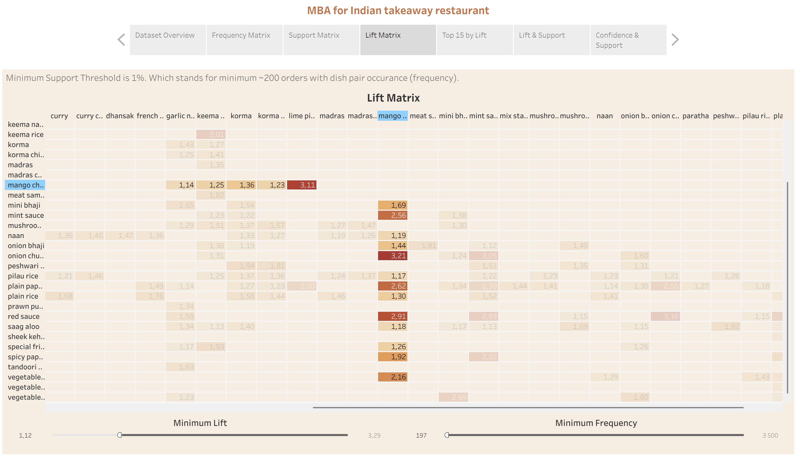

# indian-restaurant-takeaway-mba
Market Basket Analysis on 20k Indian takeaway orders — Python preprocessing, Apriori rules, Tableau dashboards, business insights.

> [!NOTE]
> Useful information that users should know, even when skimming content.

> [!TIP]
> Helpful advice for doing things better or more easily.

> [!IMPORTANT]
> Key information users need to know to achieve their goal.

> [!WARNING]
> Urgent info that needs immediate user attention to avoid problems.

> [!CAUTION]
> Advises about risks or negative outcomes of certain actions.
`code`

```
lots of code
```
>Higlight something

<details><summary>Toggle me!</summary>Peek a boo!</details>

<details open>
<summary>Shopping list</summary>

* Vegetables
* Fruits
* Fish

</details>

:mango:

## Repository Structure

- `data/raw/` — original CSV (unmodified)
- `data/processed/` — cleaned/prepared data ready for MBA
- `visuals/` —  screenshots od dashboards and ad-style promotional suggestions
- `tableau/` — Tableau packaged workbooks
- `notebooks/` — ipynb files for data preparation and apriori rules mining

> [!NOTE]
> My Tableau workbooks are also published on Tableau Public
[Part 1](https://public.tableau.com/views/Indian_Takeaway_MBA_1/MBAPart1?:language=en-GB&:sid=&:redirect=auth&:display_count=n&:origin=viz_share_link)
[Part 2](https://public.tableau.com/views/Indian_Takeaway_MBA_2/MBA-Part2?:language=en-GB&:sid=&:redirect=auth&:display_count=n&:origin=viz_share_link)

## 🔡Data

Source: [Indian Restaurant Takeaway Food Orders](https://www.kaggle.com/datasets/henslersoftware/19560-indian-takeaway-orders/data?select=restaurant-2-orders.csv) (Version 4) 

Contains:
- Orders ~20k
- Rows ~120k
- 272 unique items (after cleaning)

## 📃Overview

This project explores Market Basket Analysis (MBA) or Association Rules Mining using real restaurant order data (~20,000 transactions from an Indian takeaway). The goal is to uncover hidden patterns in how dishes are ordered together and to use these insights for menu optimization and marketing strategies.

MBA is a technique from data mining used to identify associations between items in transactional data. For restaurants, this means finding which dishes are commonly ordered together and which items are rarely chosen.

The core MBA metrics used in this project are:

- Support – how frequently an item or itemset appears in the dataset.
  
   Example: “pilau rice” is in 30% of all orders → support = 0.3.

- Confidence – given that a customer ordered item X, how likely are they to also order item Y?
  
   Example: If 70% of orders with “naan” also include “pilau rice”, then confidence(naan → pilau rice) = 0.7.

- Lift – how much more likely items are to appear together compared to if they were independent.
   - Lift > 1 means the items are positively associated (they appear together more often than chance). And item Y is likely to be bought if item X is alredy bought.
   - Lift = 1 implies no association between items.
   - Lift < 1 means the items are negativity associated. Item Y is unlikely to be bought if item X is bought.
### 🔧Tools Used
- Python
  
  I used Python for data preparation and rules mining because it is flexible, fast, and gives full control over cleaning and transformation steps. With libraries like `pandas` for preprocessing and `efficient-apriori` for association rules, I could structure the dataset exactly as needed and generate successfu results.
- Tableau
 
  For visualization, I used Tableau because it’s highly interactive and much easier for non-technical stakeholders to explore. Dashboards with metrics like support, confidence, and lift are more intuitive in Tableau than in raw Python output.

## 📑Data Preparation
Main Files: 
- [Raw data](data/raw/restaurant-2-orders.csv) → [Processed data](data/processed/takeaway_orders.csv)
- [Notebook](notebooks/MBA_takaway_data_prep.ipynb)

**Main Steps**:
1. **Load data & Get familiar with it**
   
   Columns: `Order ID`, `Order Date`, `Item Name`, `Quantity`, `Product Price`, `Total products`. Checked for missing values. Calculated total number of orders: 19658.
3. **Standaraze Dish Names**
   
   Many dishes were the same item written slightly differently. I normalized names to reduce noise:
   - fixed common misspellings and naming variants
   - unified hyphens/dashes and spaces
   - lowercased/consistent casing
     
   This reduced the menu from ~337 raw variants to 272 clean, unique dish names.

5. **Consolidate duplicates within an order**

   Some orders had the same dish repeated across multiple lines. I grouped by (Order ID, Item Name) and summed quantities so each dish appears once per order with its total Quantity.

7.  **Verify data suitability**
   
    Most orders (> 97%) include at least two items. If the majority of orders were with a single product, association mining would be       meaninglessness.
    
    Distribution of basket size: Quartiles: Q1 = 4, median = 6, Q3 = 8, max = 29. Most orders contain 3–8 items, which is good for finding co-occurrences.

9. **Choose a support threshold for analysis**

   - The dataset has ~20,000 orders, so 1% support ≈ 200 orders. Will keep results meaningful.

   - Only 114 dishes appear in ≥ 1% of all orders. This means over half of the menu is rarely chosen.

   - I’ll use 1% as the minimum support for Apriori and Tableau Dashboards. Also it is a practical line for menu optimization (extremely low-support items are [candidates to remove/replace](data/processed/unpopular_items.csv)). 

10. **Export the cleaned dataset**

    I saved the final transactional table as [takeaway_orders.csv](data/processed/takeaway_orders.csv) with three columns:
   `Order ID`, `Item Name`, `Quantity`. 


## 📊Analysis Methods
Apriori algorithm, Tableau visualizations.

## 🥭Single-dish Deep Dive

### Overview

This section shows how the project provides insights into the performance and associations of one specific dish across Tableau dashboards and Apriori algorithm outputs.

Mango chutney is a popular condiment, appearing in 17.47% of all orders (for comparison, pilau rice — the most popular dish — appears in 42.58%).

### Tableau Dashboards

In [Part 1 (Tableau workbook)](tableau/Indian_Takeaway_MBA_1.twbx) you can explore the Frequency, Support, and Lift Matrices. These matrices are symmetrical, so to avoid redundancy I only kept the lower half.
The use of color highlights the strongest associations, making patterns easy to spot at a glance.

<details><summary>Support Matrix (Tableau dasboard screenshot)</summary>

</details>

<details><summary>Lift Matrix (Tableau dasboard screenshot)</summary>

</details>

In [Part 2 (Tableau workbook)](tableau/Indian_Takeaway_MBA_2.twbx) you can filter by Antecedent/Consequent dish and sort by Frequency, Support, Confidence, or Lift, which allows quick comparisons between different rules.
<details><summary>Association rules table (Tableau dasboard screenshot)</summary>

</details>

Some insights: 

1. The strongest pair is {mango chutney} → {plain papadum}. Support: 14.97%, Confidence: 85.65%, Lift: 2.62.
   >👉 This means nearly 15% of all orders include this pair, and when mango chutney is ordered, papadum appears nearly 86% of the time. The high lift shows this is a genuine association, not     random.

2. Other strong associations: pilau rice, mint sauce, naan, onion chutney.

3. A “trick” pair example is {mango chutney} → {lime pickle}. Lift: 3.11, but Support is only 1.1% and Confidence 6.29%.
   >👉 This combination is statistically interesting but too rare to matter commercially.

### Apriori Algorithm Results
Unlike Tableau (limited to pairs), Apriori provides rules with 2–5 items.

<details>
<summary>Apriori sorted by Lift</summary>
  
```
{mango chutney} -> {onion chutney, plain papadum} (conf: 0.279, supp: 0.049, lift: 3.619, conv: 1.280)
{mango chutney} -> {plain papadum, red sauce} (conf: 0.202, supp: 0.035, lift: 3.237, conv: 1.175)
{mango chutney} -> {onion chutney} (conf: 0.296, supp: 0.052, lift: 3.207, conv: 1.289)
{mango chutney} -> {onion bhaji, plain papadum} (conf: 0.234, supp: 0.041, lift: 3.009, conv: 1.204)
{mango chutney} -> {mint sauce, plain papadum} (conf: 0.295, supp: 0.052, lift: 2.968, conv: 1.278)
{mango chutney} -> {red sauce} (conf: 0.215, supp: 0.038, lift: 2.911, conv: 1.180)
{mango chutney} -> {garlic naan, plain papadum} (conf: 0.207, supp: 0.036, lift: 2.795, conv: 1.168)
{mango chutney} -> {naan, pilau rice, plain papadum} (conf: 0.210, supp: 0.037, lift: 2.790, conv: 1.171)
{mango chutney} -> {naan, plain papadum} (conf: 0.353, supp: 0.062, lift: 2.788, conv: 1.350)
{mango chutney} -> {bombay aloo, plain papadum} (conf: 0.220, supp: 0.038, lift: 2.728, conv: 1.178)
{mango chutney} -> {pilau rice, plain papadum} (conf: 0.443, supp: 0.077, lift: 2.688, conv: 1.500)
{mango chutney} -> {plain papadum} (conf: 0.856, supp: 0.150, lift: 2.618, conv: 4.688)
{mango chutney} -> {mint sauce} (conf: 0.326, supp: 0.057, lift: 2.564, conv: 1.295)
{mango chutney} -> {onion bhaji} (conf: 0.264, supp: 0.046, lift: 1.443, conv: 1.110)
{mango chutney} -> {naan, pilau rice} (conf: 0.232, supp: 0.041, lift: 1.303, conv: 1.070)
{mango chutney} -> {naan} (conf: 0.405, supp: 0.071, lift: 1.192, conv: 1.110)
{mango chutney} -> {chicken tikka masala} (conf: 0.208, supp: 0.036, lift: 1.175, conv: 1.039)
{mango chutney} -> {pilau rice} (conf: 0.499, supp: 0.087, lift: 1.173, conv: 1.147)
{mango chutney} -> {bombay aloo} (conf: 0.245, supp: 0.043, lift: 1.165, conv: 1.046)
{mango chutney} -> {garlic naan} (conf: 0.228, supp: 0.040, lift: 1.143, conv: 1.037)
```
</details>


<details>
<summary>Apriori sorted by Support</summary>
  
```
{mango chutney} -> {plain papadum} (conf: 0.856, supp: 0.150, lift: 2.618, conv: 4.688)
{mango chutney} -> {pilau rice} (conf: 0.499, supp: 0.087, lift: 1.173, conv: 1.147)
{mango chutney} -> {pilau rice, plain papadum} (conf: 0.443, supp: 0.077, lift: 2.688, conv: 1.500)
{mango chutney} -> {naan} (conf: 0.405, supp: 0.071, lift: 1.192, conv: 1.110)
{mango chutney} -> {naan, plain papadum} (conf: 0.353, supp: 0.062, lift: 2.788, conv: 1.350)
{mango chutney} -> {mint sauce} (conf: 0.326, supp: 0.057, lift: 2.564, conv: 1.295)
{mango chutney} -> {onion chutney} (conf: 0.296, supp: 0.052, lift: 3.207, conv: 1.289)
{mango chutney} -> {mint sauce, plain papadum} (conf: 0.295, supp: 0.052, lift: 2.968, conv: 1.278)
{mango chutney} -> {onion chutney, plain papadum} (conf: 0.279, supp: 0.049, lift: 3.619, conv: 1.280)
{mango chutney} -> {onion bhaji} (conf: 0.264, supp: 0.046, lift: 1.443, conv: 1.110)
{mango chutney} -> {bombay aloo} (conf: 0.245, supp: 0.043, lift: 1.165, conv: 1.046)
{mango chutney} -> {onion bhaji, plain papadum} (conf: 0.234, supp: 0.041, lift: 3.009, conv: 1.204)
{mango chutney} -> {naan, pilau rice} (conf: 0.232, supp: 0.041, lift: 1.303, conv: 1.070)
{mango chutney} -> {garlic naan} (conf: 0.228, supp: 0.040, lift: 1.143, conv: 1.037)
{mango chutney} -> {bombay aloo, plain papadum} (conf: 0.220, supp: 0.038, lift: 2.728, conv: 1.178)
{mango chutney} -> {red sauce} (conf: 0.215, supp: 0.038, lift: 2.911, conv: 1.180)
{mango chutney} -> {naan, pilau rice, plain papadum} (conf: 0.210, supp: 0.037, lift: 2.790, conv: 1.171)
{mango chutney} -> {chicken tikka masala} (conf: 0.208, supp: 0.036, lift: 1.175, conv: 1.039)
{mango chutney} -> {garlic naan, plain papadum} (conf: 0.207, supp: 0.036, lift: 2.795, conv: 1.168)
{mango chutney} -> {plain papadum, red sauce} (conf: 0.202, supp: 0.035, lift: 3.237, conv: 1.175)

```
</details>

Additional insights for mango chutney:

{mango chutney} → {onion chutney, plain papadum}
Support: 4.9%
Confidence: 27.9%
Lift: 3.61
>👉 Suggests “condiment platter” combinations.


{mango chutney} → {pilau rice, plain papadum}
Support: 7.7%
Confidence: 44.3%
Lift: 2.69
>👉 Chutney works well as part of a fuller meal combo.

### Business Implications
🛒 Cross-selling: When mango chutney is ordered, suggest plain papadum (confidence 86%) or naan (confidence 40,49%), pilau rice (confidence 49,93%), mint sauce (confidence 32,58%) or red sauce (confidence 21,51%).

📊 Marketing: Promote chutney-based combos in ads, like mango chutney + pilau rice + plain papadum. Something like this:


## 💡Key Insights
- Great variety of dishes is clearly underappreciated by customers. More than half of the menu support is under 1% → is a direct sign for menu simplification.

- The maximum support reaches about 17%. Since the menu is large and this is real-world data, it is uncommon to see very high support values (such as 50% - items rarely dominate half of all orders).

- There are some huge numbers of lift, like for: 
   - (malaya prawn, methi prawn) 3276.3
   - (methi prawn, pathia prawn) 1638.2

   These values are caused by very rare pairs (only 2 orders each).Lift explodes when both items are extremely uncommon but happen to occur together a couple of times. This is why minimum support filter was applied in Tableau dashboards and in apriori algorithm.


## ➡️Next Step

The goal of the analysis was a menu-level MBA (like “what dishes tend to be ordered together”). But the same can be made for catagory-level, by uniting dishes into categories. 

Segmentation can be: appetizers,main courses, etc.; vegetarian vs meat; weekday vs weekend.

## 📝Recommendations

e.g., “Bundle naan + pilau rice”, “Promote papadum + chutney as starter set”.
